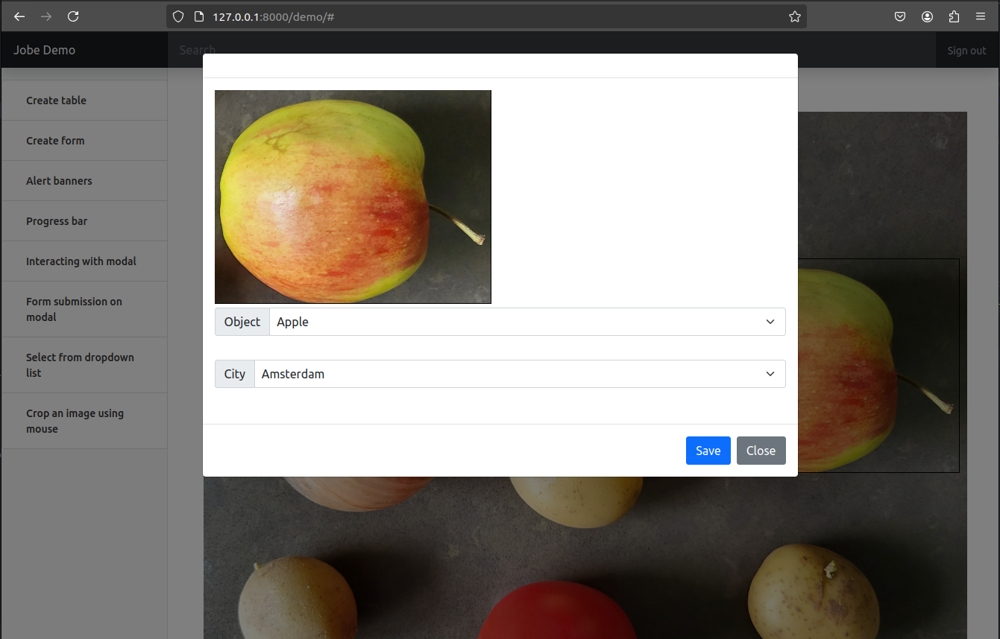

# Jobe

Jobe is JavaScript Objects for Bootstrap Elements

## Design

Jobe is written in plain JavaScript and requires only
jQuery and Bootstrap. No framworks required.

Jobe simplifies the creation and control of common
compound DOM elements (such as table, form, dropdown, modal)
and handlers (such as AJAX call, image cropping, image loading).

A Jobe object is usually created using one line of code
with meta data. It provides methods to control the DOM
behaviour as well as the transformation of the underlying
data.

The focus of Jobe is not on presenting "fancy" visual effects,
but the ease to manage the dynamics between the frontend
and the backend.

## Demo

The non-minified script is ```jobe.js```.

Script ```demo.js``` contains examples on how to use
the Jobe objects.

The demo also consists of a simple server written in Django.
Server is need to demonstrate the communicate between front
and the end via handlers.

In the demo, there is a short script that shows
how to use Jobe to

- Load an image into a canvas.

- Select and crop the desired portion of the image.

- Send the cropped image with labels to the backend.



## Update

Version 0.0.1
